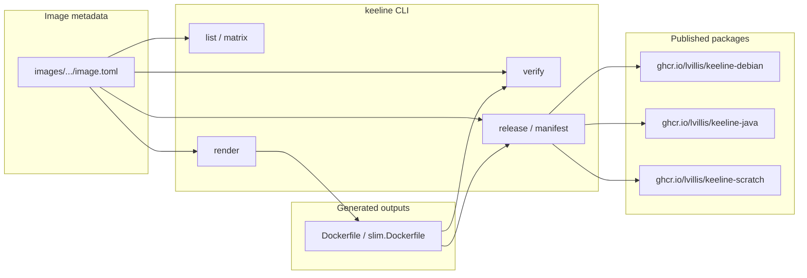

# Keeline

[](https://github.com/lvillis/keeline/actions/workflows/ci.yml)
[](https://github.com/lvillis/keeline/actions/workflows/release.yml)
[](https://crates.io/crates/keeline)
[](https://docs.rs/keeline)
[](LICENSE)
[](Cargo.toml)

[](https://github.com/users/lvillis/packages/container/package/keeline-debian)
[](https://github.com/users/lvillis/packages/container/package/keeline-java)
[](https://github.com/users/lvillis/packages/container/package/keeline-scratch)

Keeline provides small, predictable runtime container images published to GHCR.
The image line includes Debian, Debian-based Java runtimes, and a minimal
scratch tool image. Every image bundles `tino` as PID 1 plus `salus` and
`motdyn` as runtime utilities.

## Flow



## Images

| Package | Example tags | Purpose |
|---|---|---|
| `ghcr.io/lvillis/keeline-debian` | `13`, `13-slim` | Debian 13 base images |
| `ghcr.io/lvillis/keeline-java` | `17-trixie`, `21-trixie`, `8u372-trixie-slim` | Debian-based Java runtimes |
| `ghcr.io/lvillis/keeline-scratch` | `1` | Minimal `FROM scratch` image with `tino`, `salus`, and `motdyn` |

## Tag Rules

- Package names express the image family.
- Image tags express version and variant.
- Debian tags use forms like `13` and `13-slim`.
- Java tags omit the package family and use forms like `21-trixie`, `21.0.10-trixie`, `8u372-trixie`, and `8u372-trixie-slim`.
- Scratch tags currently use `1`.
- `latest` is not published.

## Usage

Examples:

```bash
docker pull ghcr.io/lvillis/keeline-debian:13
docker pull ghcr.io/lvillis/keeline-java:21-trixie
docker pull ghcr.io/lvillis/keeline-java:8u372-trixie
docker pull ghcr.io/lvillis/keeline-scratch:1
```

For strongly reproducible deployments, pin by digest.

## Scope

- Debian images provide a clean Debian 13 base.
- Java images provide Debian 13 based Java runtimes built for stable consumption.
- Scratch images provide a minimal `FROM scratch` base containing only the bundled runtime tools.
- All images include `tino` at `/sbin/tino` and start through `ENTRYPOINT ["/sbin/tino", "-g", "-s", "--"]`.
- All images include `salus` at `/bin/salus` for downstream `HEALTHCHECK` and Kubernetes `exec` probes.
- All images include `motdyn` slim at `/usr/local/bin/motdyn` for lightweight startup or MOTD-style template rendering.
- Java `slim` images reduce runtime packages and use `C.UTF-8` instead of generated `en_US.UTF-8` locales.
- The project keeps image families separate instead of mixing them into one package with complex tags.
