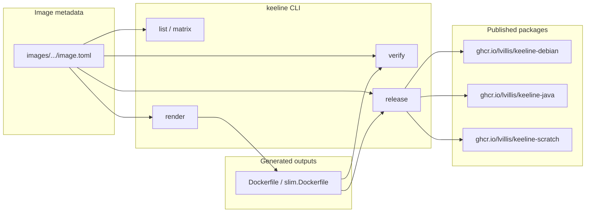

# Keeline

Keeline provides Debian-based runtime images and a minimal scratch tool image
published to GHCR, with `tino` integrated as the default PID 1 init process
plus `salus` and `motdyn` bundled as runtime utilities across the image line.

## Flow



## Images

| Package | Example tags | Purpose |
|---|---|---|
| `ghcr.io/lvillis/keeline-debian` | `13`, `13-slim` | Debian 13 base images |
| `ghcr.io/lvillis/keeline-java` | `jdk-17-trixie`, `jdk-21-trixie`, `jdk-8u372-trixie-slim` | Debian-based Java runtimes |
| `ghcr.io/lvillis/keeline-scratch` | `1` | Minimal `FROM scratch` image with `tino`, `salus`, and `motdyn` |

## Tag Rules

- Package names express the image family.
- Image tags express version and variant.
- Debian tags use forms like `13` and `13-slim`.
- Java tags include the runtime shape, with forms like `jdk-21-trixie`, `jdk-21.0.10-trixie`, `jdk-8u372-trixie`, and `jdk-8u372-trixie-slim`.
- Scratch tags currently use `1`.
- `latest` is not published.

## Usage

Examples:

```bash
docker pull ghcr.io/lvillis/keeline-debian:13
docker pull ghcr.io/lvillis/keeline-java:jdk-21-trixie
docker pull ghcr.io/lvillis/keeline-java:jdk-8u372-trixie
docker pull ghcr.io/lvillis/keeline-scratch:1
```

For strongly reproducible deployments, pin by digest.

## Scope

- Debian images provide a clean Debian 13 base.
- JDK images provide Debian 13 based Java runtimes built for stable consumption.
- Scratch images provide a minimal `FROM scratch` base containing only the bundled runtime tools.
- All images include `tino` at `/sbin/tino` and start through `ENTRYPOINT ["/sbin/tino", "-g", "-s", "--"]`.
- All images include `salus` at `/bin/salus` for downstream `HEALTHCHECK` and Kubernetes `exec` probes.
- All images include `motdyn` slim at `/usr/local/bin/motdyn` for lightweight startup or MOTD-style template rendering.
- JDK `slim` images reduce runtime packages and use `C.UTF-8` instead of generated `en_US.UTF-8` locales.
- The project keeps image families separate instead of mixing them into one package with complex tags.
